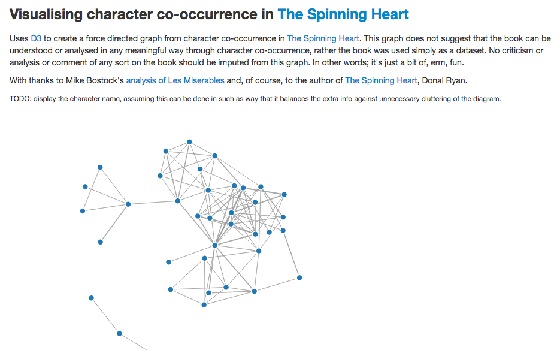

About
=======================

> Force directed graphs using the characters from “The Spinning Heart” by Donal Ryan

#### What?

Uses [D3](http://nickqizhu.github.io/dc.js/) to create a force directed graph from character co-occurrence in [The Spinning Heart](http://www.lilliputpress.ie/book/144232506/donal_ryan-the_spinning_heart.html). 

#### Eh, Really?

Yes. Bear in mind that this graph does not suggest that the book can be understood or analysed in any meaningful way through character co-occurrence, rather the book was used simply as a dataset. No criticism or analysis or comment of any sort on the book should be imputed from this graph. In other words; it's just a bit of, erm, fun.	

#### What Does It Look Like?

